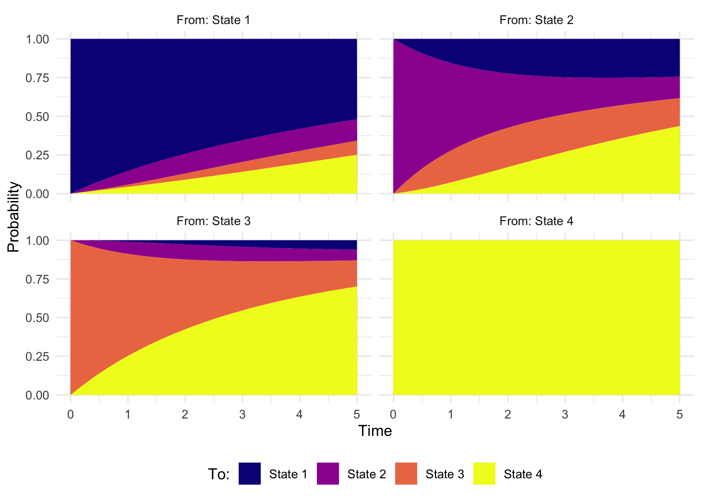
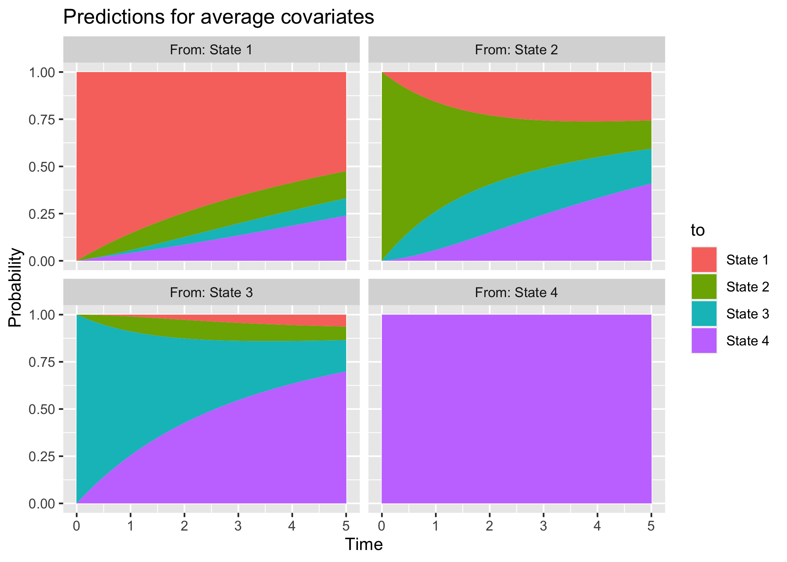
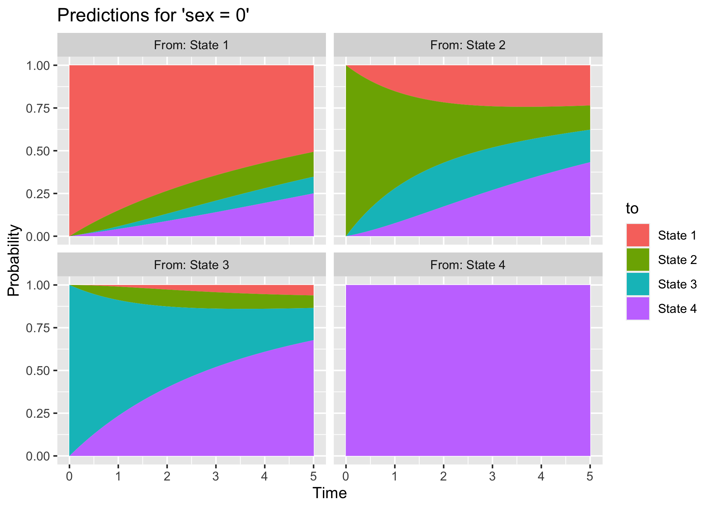
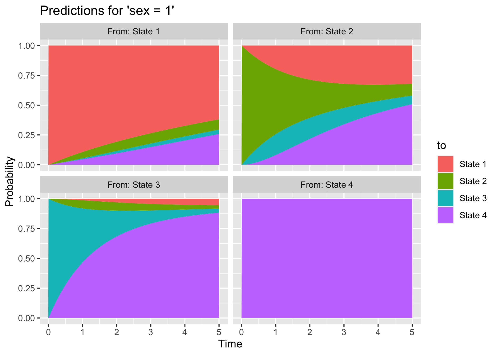
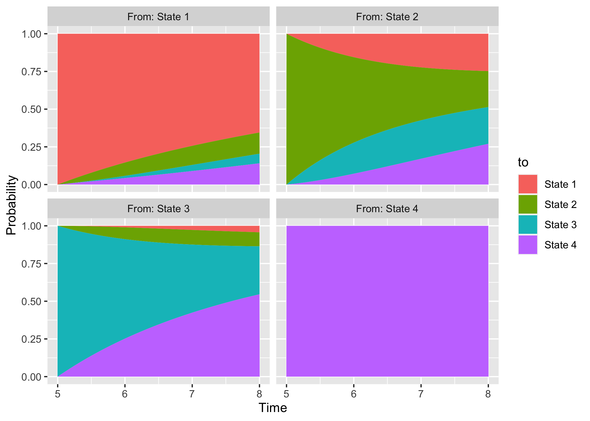
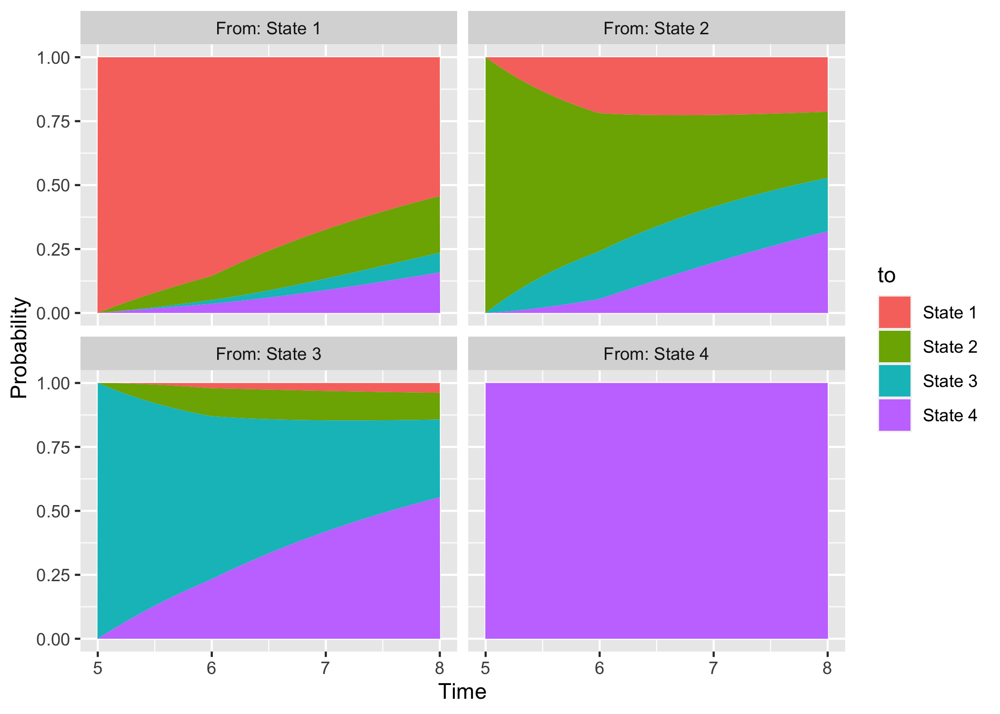
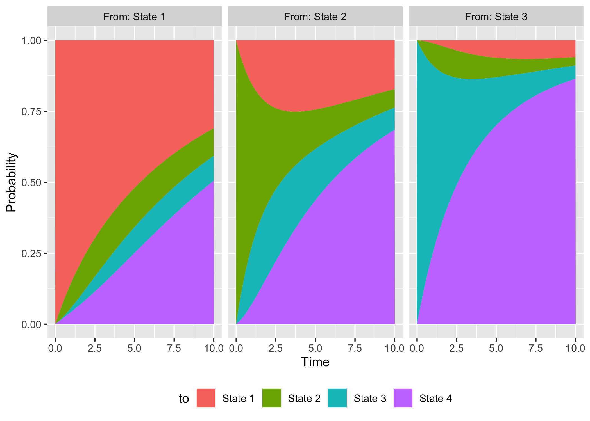

<!-- README.md is generated from README.Rmd. Please edit that file -->

# {msm.stacked}

<!-- badges: start -->

[](https://github.com/RedDoorAnalytics/msm.stacked/actions/workflows/R-CMD-check.yaml)
<!-- badges: end -->

The {msm.stacked} package can be used to simplify the calculation of
state transition probabilities over time and the creation of stacked
probabilities plot from multi-state model fits from the
[{msm}](https://CRAN.R-project.org/package=msm) package.

# Installation

You can install the development version of {msm.stacked} from
[GitHub](https://github.com/RedDoorAnalytics/msm.stacked) with:

``` r
# install.packages("devtools")
devtools::install_github("RedDoorAnalytics/msm.stacked")
```

# Example

To illustrate the functionality of {msm.stacked}, we build upon the
documentation for the `msm::msm()` function. We will be using the heart
transplant data:

``` r
library(msm)
head(cav)
#>    PTNUM      age    years dage sex pdiag cumrej state firstobs statemax
#> 1 100002 52.49589 0.000000   21   0   IHD      0     1        1        1
#> 2 100002 53.49863 1.002740   21   0   IHD      2     1        0        1
#> 3 100002 54.49863 2.002740   21   0   IHD      2     2        0        2
#> 4 100002 55.58904 3.093151   21   0   IHD      2     2        0        2
#> 5 100002 56.49589 4.000000   21   0   IHD      3     2        0        2
#> 6 100002 57.49315 4.997260   21   0   IHD      3     3        0        3
```

Further details on this example dataset are included in the [vignette of
the {msm}
package](https://CRAN.R-project.org/package=msm/vignettes/msm-manual.pdf).

We start with a matrix of possible transitions:

``` r
twoway4.q <- rbind(
  c(-0.5, 0.25, 0, 0.25),
  c(0.166, -0.498, 0.166, 0.166),
  c(0, 0.25, -0.5, 0.25),
  c(0, 0, 0, 0)
)
twoway4.q
#>        [,1]   [,2]   [,3]  [,4]
#> [1,] -0.500  0.250  0.000 0.250
#> [2,]  0.166 -0.498  0.166 0.166
#> [3,]  0.000  0.250 -0.500 0.250
#> [4,]  0.000  0.000  0.000 0.000
```

This is then used to provide starting values for the model without
additional covariates:

``` r
cav.msm <- msm(
  formula = state ~ years,
  subject = PTNUM,
  data = cav,
  qmatrix = twoway4.q,
  deathexact = 4
)
cav.msm
#> 
#> Call:
#> msm(formula = state ~ years, subject = PTNUM, data = cav, qmatrix = twoway4.q,     deathexact = 4)
#> 
#> Maximum likelihood estimates
#> 
#> Transition intensities
#>                   Baseline                    
#> State 1 - State 1 -0.17037 (-0.19027,-0.15255)
#> State 1 - State 2  0.12787 ( 0.11135, 0.14684)
#> State 1 - State 4  0.04250 ( 0.03412, 0.05294)
#> State 2 - State 1  0.22512 ( 0.16755, 0.30247)
#> State 2 - State 2 -0.60794 (-0.70880,-0.52143)
#> State 2 - State 3  0.34261 ( 0.27317, 0.42970)
#> State 2 - State 4  0.04021 ( 0.01129, 0.14324)
#> State 3 - State 2  0.13062 ( 0.07952, 0.21457)
#> State 3 - State 3 -0.43710 (-0.55292,-0.34554)
#> State 3 - State 4  0.30648 ( 0.23822, 0.39429)
#> 
#> -2 * log-likelihood:  3968.798
```

We can use the `plot.msm()` function to plot survival curves from every
transient state to the final, absorbing state (e.g., a state denoting
death). This is denoted in the `cav` dataset by *state 4*:

``` r
plot(cav.msm, from = 1:3, to = 4)
```


The {msm} package also provides functionality to calculate state
transition probabilities at a given point in time. Say we are interested
in estimating the probability of being in a given state, from each
state, five years after baseline; we can use the `pmatrix.msm()`
function to obtain just that:

``` r
pmatrix.msm(x = cav.msm, t = 5)
#>            State 1    State 2    State 3   State 4
#> State 1 0.51965804 0.13851775 0.09119847 0.2506257
#> State 2 0.24386420 0.13881410 0.18090731 0.4364144
#> State 3 0.06121333 0.06897186 0.16909991 0.7007149
#> State 4 0.00000000 0.00000000 0.00000000 1.0000000
```

This shows that, for instance, study participants in State 1 at time
zero have (approximately) a 52% probability of still being in State 1
after years, 14% probability of being in State 2, 9% probability of
being in State 3, and 25% probability of being in State 4.

We can repeatedly call the `pmatrix.msm()` function to obtain
probabilities over time, but that’s a bit tedious. This is where the
{msm.stacked} package comes in handy.

Specifically, we can use the `stacked.data.msm()` function to calculate
transition probabilities over time, say, at 1 to 5 years:

``` r
library(msm.stacked)
sdd <- stacked.data.msm(model = cav.msm, tstart = 0, tforward = 5, tseqn = 6)
str(sdd)
#> 'data.frame':    96 obs. of  5 variables:
#>  $ from  : Factor w/ 4 levels "State 1","State 2",..: 1 2 3 4 1 2 3 4 1 2 ...
#>  $ to    : Factor w/ 4 levels "State 1","State 2",..: 1 1 1 1 2 2 2 2 3 3 ...
#>  $ p     : num  1 0 0 0 0 1 0 0 0 0 ...
#>  $ tstart: num  0 0 0 0 0 0 0 0 0 0 ...
#>  $ t     : num  0 0 0 0 0 0 0 0 0 0 ...
```

This returns a tidy dataset with all transition probabilities, from and
to every state, over `tseqn = 6` equally-spaced time intervals between
time zero and time five. Focussing on transitions from State 1 only:

``` r
subset(sdd, sdd$from == "State 1")
#>       from      to          p tstart t
#> 1  State 1 State 1 1.00000000      0 0
#> 5  State 1 State 2 0.00000000      0 0
#> 9  State 1 State 3 0.00000000      0 0
#> 13 State 1 State 4 0.00000000      0 0
#> 17 State 1 State 1 0.85395872      0 1
#> 21 State 1 State 2 0.08836953      0 1
#> 25 State 1 State 3 0.01475543      0 1
#> 29 State 1 State 4 0.04291632      0 1
#> 33 State 1 State 1 0.74313989      0 2
#> 37 State 1 State 2 0.12669585      0 2
#> 41 State 1 State 3 0.04053779      0 2
#> 45 State 1 State 4 0.08962646      0 2
#> 49 State 1 State 1 0.65472323      0 3
#> 53 State 1 State 2 0.14064466      0 3
#> 57 State 1 State 3 0.06380519      0 3
#> 61 State 1 State 4 0.14082692      0 3
#> 65 State 1 State 1 0.58161960      0 4
#> 69 State 1 State 2 0.14256253      0 4
#> 73 State 1 State 3 0.08072247      0 4
#> 77 State 1 State 4 0.19509541      0 4
#> 81 State 1 State 1 0.51965804      0 5
#> 85 State 1 State 2 0.13851775      0 5
#> 89 State 1 State 3 0.09119847      0 5
#> 93 State 1 State 4 0.25062574      0 5
```

Here we see, for instance, that the probability of still being in State
1, starting from State 1, is (approximately) 85% after one year, 74%
after two years, 65% after three years, 58% after four years, and 52%
after five years:

``` r
subset(sdd, sdd$from == "State 1" & sdd$to == "State 1")
#>       from      to         p tstart t
#> 1  State 1 State 1 1.0000000      0 0
#> 17 State 1 State 1 0.8539587      0 1
#> 33 State 1 State 1 0.7431399      0 2
#> 49 State 1 State 1 0.6547232      0 3
#> 65 State 1 State 1 0.5816196      0 4
#> 81 State 1 State 1 0.5196580      0 5
```

The package also provides functionality to automatically produce stacked
probabilities plots, for transition probabilities from and to every
state. This is implemented in the `stacked.plot.msm()` function:

``` r
stacked.plot.msm(model = cav.msm, tstart = 0, tforward = 5)
```


This relies on [{ggplot2}](https://ggplot2.tidyverse.org) functionality
and returns a standard `ggplot` object, which can of course be further
customised beyond the default settings:

``` r
library(ggplot2)

stacked.plot.msm(model = cav.msm, tstart = 0, tforward = 5) +
  scale_fill_viridis_d(option = "plasma") +
  theme_minimal() +
  theme(legend.position = "bottom") +
  labs(fill = "To:")
```



# Model with Covariates

We can of course incorporate covariates in a multi-state model and
obtain predictions for a specific covariates pattern; let’s demonstrate
this by incorporating sex in the model above. First, we fit a second
model:

``` r
cav.msm.cov <- msm(
  formula = state ~ years,
  subject = PTNUM,
  data = cav,
  covariates = ~sex,
  qmatrix = twoway4.q,
  deathexact = 4
)
cav.msm.cov
#> 
#> Call:
#> msm(formula = state ~ years, subject = PTNUM, data = cav, qmatrix = twoway4.q,     covariates = ~sex, deathexact = 4)
#> 
#> Maximum likelihood estimates
#> Baselines are with covariates set to their means
#> 
#> Transition intensities with hazard ratios for each covariate
#>                   Baseline                        
#> State 1 - State 1 -0.16938 (-1.894e-01,-1.515e-01)
#> State 1 - State 2  0.12745 ( 1.108e-01, 1.466e-01)
#> State 1 - State 4  0.04193 ( 3.354e-02, 5.241e-02)
#> State 2 - State 1  0.22645 ( 1.686e-01, 3.042e-01)
#> State 2 - State 2 -0.58403 (-1.053e+00,-3.238e-01)
#> State 2 - State 3  0.33693 ( 2.697e-01, 4.209e-01)
#> State 2 - State 4  0.02065 ( 2.196e-09, 1.941e+05)
#> State 3 - State 2  0.13050 ( 7.830e-02, 2.175e-01)
#> State 3 - State 3 -0.44178 (-5.582e-01,-3.497e-01)
#> State 3 - State 4  0.31128 ( 2.425e-01, 3.996e-01)
#>                   sex                            
#> State 1 - State 1                                
#> State 1 - State 2 0.5632779 (3.333e-01,9.518e-01)
#> State 1 - State 4 1.1289701 (6.262e-01,2.035e+00)
#> State 2 - State 1 1.2905854 (4.916e-01,3.388e+00)
#> State 2 - State 2                                
#> State 2 - State 3 1.0765518 (5.194e-01,2.231e+00)
#> State 2 - State 4 0.0003805 (7.241e-65,1.999e+57)
#> State 3 - State 2 1.0965531 (1.345e-01,8.937e+00)
#> State 3 - State 3                                
#> State 3 - State 4 2.4135380 (1.176e+00,4.952e+00)
#> 
#> -2 * log-likelihood:  3954.777
```

Then, we can use the same functionality as before to obtain stacked
probabilities plots:

``` r
stacked.plot.msm(model = cav.msm.cov, tstart = 0, tforward = 5) +
  labs(title = "Predictions for average covariates")
```



By default, this will set all covariates to their average value (as in
`pmatrix.msm()`); we can, however, pass specific covariates patterns
that we want to predict for:

``` r
stacked.plot.msm(model = cav.msm.cov, tstart = 0, tforward = 5, covariates = list(sex = 0)) +
  labs(title = "Predictions for 'sex = 0'")
```



``` r
stacked.plot.msm(model = cav.msm.cov, tstart = 0, tforward = 5, covariates = list(sex = 1)) +
  labs(title = "Predictions for 'sex = 1'")
```



This way we can provide clinically meaningful predictions that highlight
the effect of covariates of interest on state occupancy probabilities
over time.

# Model with Piecewise-Constant Intensities

By default, the {msm} package assumes constant (i.e., exponential)
baseline transition intensities. This means that predictions at t years
will be the same, irrespectively of when the starting point is:

``` r
stacked.plot.msm(model = cav.msm, tstart = 0, tforward = 3)
```


``` r
stacked.plot.msm(model = cav.msm, tstart = 5, tforward = 3, start0 = FALSE)
```



We can relax this assumption by allowing piecewise-constant baseline
transition rates. This can be done by setting the `pci` argument of
`msm()`:

``` r
cav.msm.pw <- msm(
  formula = state ~ years,
  subject = PTNUM,
  data = cav,
  qmatrix = twoway4.q,
  deathexact = 4,
  pci = quantile(x = cav$years, probs = c(0.25, 0.50, 0.75))
)
#> Warning in msm(formula = state ~ years, subject = PTNUM, data = cav, qmatrix =
#> twoway4.q, : Optimisation has probably not converged to the maximum likelihood
#> - Hessian is not positive definite.
cav.msm.pw
#> 
#> Call:
#> msm(formula = state ~ years, subject = PTNUM, data = cav, qmatrix = twoway4.q,     deathexact = 4, pci = quantile(x = cav$years, probs = c(0.25,         0.5, 0.75)))
#> 
#> Optimisation probably not converged to the maximum likelihood.
#> optim() reported convergence but estimated Hessian not positive-definite.
#> 
#> -2 * log-likelihood:  3887.911
```

Specifically, here we set cut-points at quartiles of the observed
distribution of (possibly censored) transition times. We ignore the
warning about *non-convergence* for now - in practice, we should
investigate this and try a different optimiser or “consider tightening
the tolerance criteria for convergence” (according to the documentation
of `msm()`).

First, we can do a likelihood ratio test to check whether the model with
piecewise-constant intensities fits the data better:

``` r
lrtest.msm(cav.msm, cav.msm.pw)
#>            -2 log LR df            p
#> cav.msm.pw   80.8872 21 5.736045e-09
```

The test is statistically significant at any usual level, thus the more
flexible model seems appropriate. Predictions of transition
probabilities will now depend on the starting point `tstart`, even
though `tforward` is the same:

``` r
stacked.plot.msm(model = cav.msm.pw, tstart = 0, tforward = 3)
```


``` r
stacked.plot.msm(model = cav.msm.pw, tstart = 5, tforward = 3, start0 = FALSE)
```



As expected, we see that the predicted probabilities between 0 and 3
units of time are now different compared to those between 5 and 8, given
the (now) non-constant baseline intensities.

# Excluding States

The {msm.stacked} package also include functionality to calculate (and
plot) transition probabilities from only certain states of interest. For
instance, the models we fit in the previous examples includes an
absorbing state, *State 4*, from which there will be no transitions. For
this example, we will be using the model with constant baseline
transition rates (`cav.msm`).

Let’s start with a utility function to determine the names of the state
of a {msm} model fit, which is included in {msm.stacked}. This is called
`states.msm()`:

``` r
states.msm(cav.msm)
#> [1] "State 1" "State 2" "State 3" "State 4"
```

Now we have the correct names used by {msm} to define each state. Let’s
calculate transitions probabilities from all states, but excluding the
absorbing *State 4*:

``` r
stacked.data.msm(model = cav.msm, tstart = 0, tforward = 1, tseqn = 3, exclude = "State 4")
#>       from      to           p tstart   t
#> 1  State 1 State 1 1.000000000      0 0.0
#> 2  State 2 State 1 0.000000000      0 0.0
#> 3  State 3 State 1 0.000000000      0 0.0
#> 4  State 1 State 2 0.000000000      0 0.0
#> 5  State 2 State 2 1.000000000      0 0.0
#> 6  State 3 State 2 0.000000000      0 0.0
#> 7  State 1 State 3 0.000000000      0 0.0
#> 8  State 2 State 3 0.000000000      0 0.0
#> 9  State 3 State 3 1.000000000      0 0.0
#> 10 State 1 State 4 0.000000000      0 0.0
#> 11 State 2 State 4 0.000000000      0 0.0
#> 12 State 3 State 4 0.000000000      0 0.0
#> 13 State 1 State 1 0.921422669      0 0.5
#> 14 State 2 State 1 0.093120696      0 0.5
#> 15 State 3 State 1 0.003009286      0 0.5
#> 16 State 1 State 2 0.052893658      0 0.5
#> 17 State 2 State 2 0.745001419      0 0.5
#> 18 State 3 State 2 0.050466555      0 0.5
#> 19 State 1 State 3 0.004483375      0 0.5
#> 20 State 2 State 3 0.132369477      0 0.5
#> 21 State 3 State 3 0.808061596      0 0.5
#> 22 State 1 State 4 0.021200298      0 0.5
#> 23 State 2 State 4 0.029508408      0 0.5
#> 24 State 3 State 4 0.138462563      0 0.5
#> 25 State 1 State 1 0.853958721      0 1.0
#> 26 State 2 State 1 0.155576908      0 1.0
#> 27 State 3 State 1 0.009903994      0 1.0
#> 28 State 1 State 2 0.088369526      0 1.0
#> 29 State 2 State 2 0.566632840      0 1.0
#> 30 State 3 State 2 0.078536913      0 1.0
#> 31 State 1 State 3 0.014755432      0 1.0
#> 32 State 2 State 3 0.205995634      0 1.0
#> 33 State 3 State 3 0.659657266      0 1.0
#> 34 State 1 State 4 0.042916321      0 1.0
#> 35 State 2 State 4 0.071794618      0 1.0
#> 36 State 3 State 4 0.251901827      0 1.0
```

As you can see, transitions from the state passed to `exclude` are not
reported. We can also exclude more than one state, for instance if we
want to calculate only transitions from *State 1*:

``` r
stacked.data.msm(model = cav.msm, tstart = 0, tforward = 1, tseqn = 3, exclude = c("State 2", "State 3", "State 4"))
#>       from      to           p tstart   t
#> 1  State 1 State 1 1.000000000      0 0.0
#> 2  State 1 State 2 0.000000000      0 0.0
#> 3  State 1 State 3 0.000000000      0 0.0
#> 4  State 1 State 4 0.000000000      0 0.0
#> 5  State 1 State 1 0.921422669      0 0.5
#> 6  State 1 State 2 0.052893658      0 0.5
#> 7  State 1 State 3 0.004483375      0 0.5
#> 8  State 1 State 4 0.021200298      0 0.5
#> 9  State 1 State 1 0.853958721      0 1.0
#> 10 State 1 State 2 0.088369526      0 1.0
#> 11 State 1 State 3 0.014755432      0 1.0
#> 12 State 1 State 4 0.042916321      0 1.0
```

Of course, this functionality is also included in the plotting function:

``` r
stacked.plot.msm(model = cav.msm, tstart = 0, tforward = 10, exclude = "State 4") +
  theme(legend.position = "bottom")
```


